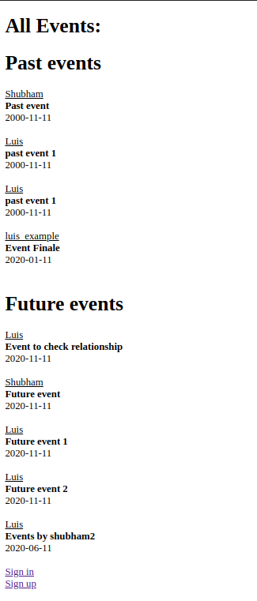
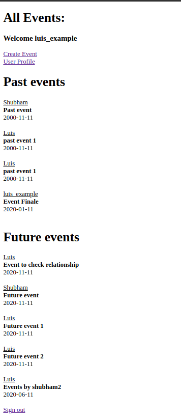
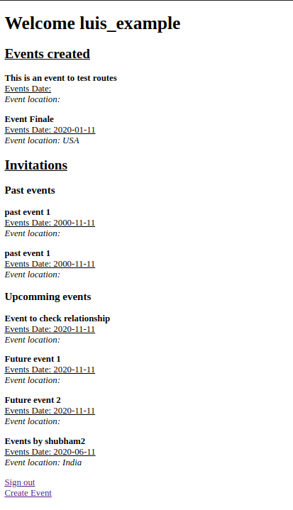
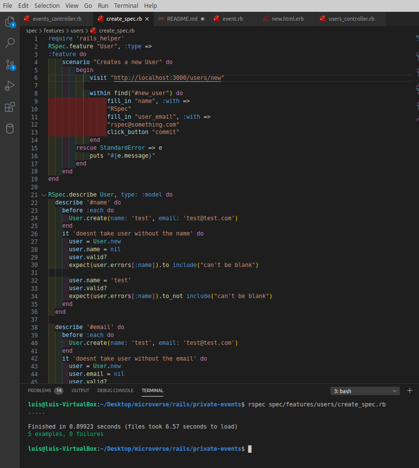

# private-events

In this project, we were able to apply all the previously acquired knowledge on Routing, Active Record, Models, Controllers, and some newly acquired knowledge on Advanced Active Record Queries and Associations. The project is very comprehensive and it was a challenge to put everything learned so far together to complete it.







Additional to working with advanced Active Records, we implemented testing using Capibara and RSpec. We included testing for going to the website and making sure the form and fields were there and for the presence of mandatory fields for each class.



# Requirements

- Ruby > 2.6.5
- Rails > 6.0.3

## Getting Started

To get started with the app, cd to the directory where you would like the repo to live by typing on your terminal:

```
$ cd <directory>
```

Clone the repo typing:

```
$ git clone git@github.com:lmaldonadoch/private-events.git
```

Install the needed gems:

```
$ bundle install
```

Finally, migrate the database:

```
$ rails db:migrate
```

# Instructions

## Creating a new user and creating events.

- Please create a new user to be able to create events.
- Create events to see them in the Home Page

## Viewing the linked events to a previously created user.

- Sign in with the username luis_example to be able see in the profile page all the events he is invited to.
- Sign in with user Luis to be able to see many created events.

## Testing

- To run the tests, go to the command line and type:

```
rspec spec/features/users/create_spec.rb
```

## Built With

- Ruby
- Rails
- VSCode

## Authors

👤 **Luis Angel Maldonado**

- Github: [@lmaldonadoch](https://github.com/lmaldonadoch)
- Twitter: [@LuisAngelMCh](https://twitter.com/LuisAngelMCh)
- Linkedin: [linkedin](https://www.linkedin.com/in/lmaldonadoch)

👤 **Shubham Raj**

- Github: [@ShubhamRaj](https://github.com/shubham14p3)
- Linkedin: [Shubham14p3](https://www.linkedin.com/in/shubham14p3/)

## 🤝 Contributing

Contributions, issues and feature requests are welcome!

Feel free to check the [issues page](https://github.com/shubham14p3/micro_reddit/issues/).

## Acknowledgement

- Project requested by [Microverse Program](https://www.microverse.org/).
- Original project from [The Odin Project](https://www.theodinproject.com/courses/ruby-on-rails/lessons/forms).

## Show your support

Give a ⭐️ if you like this project!!!
